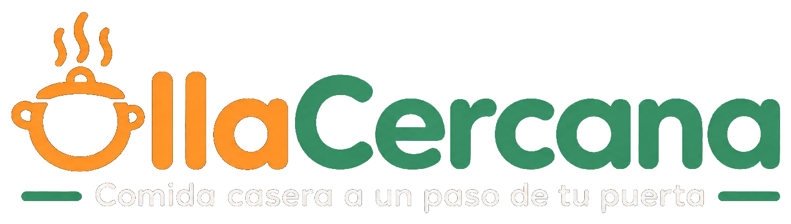

# OllaCercana — Frontend (React + TypeScript)

Plataforma web que conecta a vecinos que cocinan comida casera y les sobran
porciones, con vecinos cercanos que quieren comprarlas a un precio justo.
Un mercado hiperlocal (radio de 500 m a 2 km) donde la cercanía física
genera la confianza, en vez de una calificación anónima de una app grande.

Este repositorio contiene el **frontend** de OllaCercana. En este punto del
proyecto (TASK-09) solo se inicializa la estructura base del proyecto
(Vite + React + TypeScript); los componentes de cada módulo se irán
agregando en los siguientes sprints, uno por historia de usuario.

<p align="center">
  
</p>

## Equipo

- Daniel Camilo Mosquera Martínez
- Juan Manuel Garzón Viracacha
- Kevin Andrey Ángel Acevedo
- Julián Felipe Morales Zambrano
- Santiago Andrés García Almario

*(Corregir/completar esta lista si falta o sobra alguien.)*

## Contexto del proyecto

OllaCercana nace de una situación muy común en conjuntos residenciales y
barrios: alguien cocina de más, esa comida se pierde por falta de un
comprador cercano, mientras un vecino paga un domicilio caro por algo que
podría conseguir más barato y más fresco a pocos metros de su casa.

La plataforma no reemplaza restaurantes ni servicios de domicilio: funciona
como un mercado hiperlocal donde:

- Quienes viven solos o no tienen tiempo de cocinar pagan entre $25.000 y
  $35.000 por un domicilio convencional, cuando podrían comer casero por
  $8.000 a $12.000.
- Todos los días se desperdicia comida que podría venderse simplemente
  porque no hay un comprador accesible en el momento.
- Los grupos de WhatsApp de los conjuntos son informales: no tienen
  búsqueda, ni reseñas, ni historial de confianza.
- No existe una forma sencilla de generar un ingreso extra desde el hogar
  sin montar un negocio formal (registro, local, nómina).

El detalle completo del enunciado, requerimientos funcionales/no
funcionales y reglas de negocio está en
`OllaCercana_Documento_Corte2.pdf` (carpeta raíz del proyecto).

## Identidad de marca

- **Isotipo/logotipo:** `src/assets/branding/logo-icon.png` (isotipo) y
  `src/assets/branding/logo-wordmark.png` (logotipo completo).
- **Manual de Identidad (documento independiente, TASK-07):**
  [`docs/branding/Manual_de_Identidad_OllaCercana_v2.pdf`](docs/branding/Manual_de_Identidad_OllaCercana_v2.pdf).
  Este PDF es el entregable completo (logo, paleta, tipografía, iconografía,
  propósito y valores); la presentación del Sprint Review solo resume sus
  puntos clave y no lo reemplaza.
  > **Pendiente:** subir este PDF a Teams y reemplazar el enlace de arriba
  > por la URL de Teams una vez publicado ahí.

## Prototipo de diseño (Figma)

Prototipo funcional en Figma Make:
https://www.figma.com/make/YouP0kGe98NJeKPKGDoSUZ/OllaCercana-app-design

## Módulos / pantallas

Según el prototipo, la aplicación se organiza en estos módulos (nombres
tal como aparecen en la navegación del prototipo):

| Módulo | Pantalla(s) | Descripción |
|---|---|---|
| Autenticación | Landing, Login, Register | Página de bienvenida pública y flujo de inicio de sesión / registro. |
| Inicio | Home | Feed principal: saludo, buscador, categorías y platos/cocineras destacados cerca del usuario. |
| Explorar | Explore | Búsqueda y filtrado de platos disponibles por tipo, distancia, etc. |
| Mapa | MapView | Vista en mapa de cocineras y platos cercanos (geolocalización). |
| Detalle de plato | DishDetail | Ficha del plato (fotos, precio, porciones, punto de entrega, restricciones) y flujo de reserva (apartar porción, pago contra entrega). |
| Carrito | Cart | Resumen de la(s) reserva(s) antes de confirmar. |
| Publicar plato | PublishDish | Formulario para que una cocinera publique un plato (foto, precio, porciones, horario, punto de entrega). Se retira automáticamente a las 4 horas. |
| Mis pedidos | MyOrders | Reservas activas del usuario (como comprador o como cocinera). |
| Historial | OrderHistory | Historial de compras/ventas pasadas. |
| Mensajes | Messages | Chat entre cocinera y comprador para coordinar la entrega. |
| Notificaciones | Notifications | Notificaciones push (nueva reserva, confirmación, recordatorios). |
| Perfil | Profile | Perfil del usuario (comprador/cocinera), calificación y datos básicos. |
| Ajustes | Settings | Configuración de cuenta. |
| Vista móvil | MobileView | Vista responsive del prototipo para pantallas pequeñas. |

Reglas de negocio clave reflejadas en el prototipo: una publicación expira
automáticamente 4 horas después de publicada (RN-02); una reserva no
confirmada por la cocinera se libera automáticamente a los 10 minutos
(RN-10); nunca se muestra la dirección exacta de la cocinera, solo el
conjunto/barrio (OC-RNF-07); el pago es siempre contra entrega (efectivo,
Nequi o Daviplata) — la plataforma no procesa dinero.

**Capturas de los mockups:** _pendientes de adjuntar._ Expórtalas desde
Figma Make (botón compartir/exportar de cada pantalla) y colócalas en
`src/assets/mockups/`, enlazándolas en la tabla de arriba.

## Stack tecnológico

- **Frontend:** React + TypeScript (este repositorio), empaquetado con Vite.
- **Backend:** Spring Boot (arquitectura en capas Controller / Service /
  Repository — ver `ollacercana_diagrama_componentes.drawio`).
- **Persistencia:** PostgreSQL.
- **Tiempo real:** WebSockets (disponibilidad de platos).
- **Geolocalización:** Mapbox / Google Maps.
- **Notificaciones:** Firebase Cloud Messaging (FCM).

## Cómo correr el proyecto

```bash
npm install
npm run dev
```

> Nota: por ahora `src/App.tsx` solo muestra una pantalla de arranque; no
> hay componentes de módulos todavía (eso es intencional en TASK-09).

## Estructura del repositorio

```
ollacercana-frontend/
├── docs/
│   └── branding/
│       └── Manual_de_Identidad_OllaCercana_v2.pdf
├── src/
│   ├── assets/
│   │   ├── branding/       # isotipo y logotipo
│   │   └── mockups/        # capturas de pantallas (pendiente)
│   ├── App.tsx             # placeholder de arranque
│   ├── main.tsx
│   ├── index.css
│   └── vite-env.d.ts
├── public/
├── index.html
├── package.json
├── tsconfig.json / tsconfig.app.json / tsconfig.node.json
├── vite.config.ts
└── README.md
```

## Estado actual

- [x] Estructura base del repositorio (Vite + React + TypeScript)
- [x] Isotipo/logotipo integrados
- [x] Enlace al prototipo de Figma
- [x] Manual de Identidad incluido en el repo (TASK-07)
- [ ] Manual de Identidad publicado en Teams (enlace pendiente de reemplazar)
- [ ] Capturas de los mockups (pendientes de exportar desde Figma)
- [ ] Componentes de los módulos (sprints siguientes)
